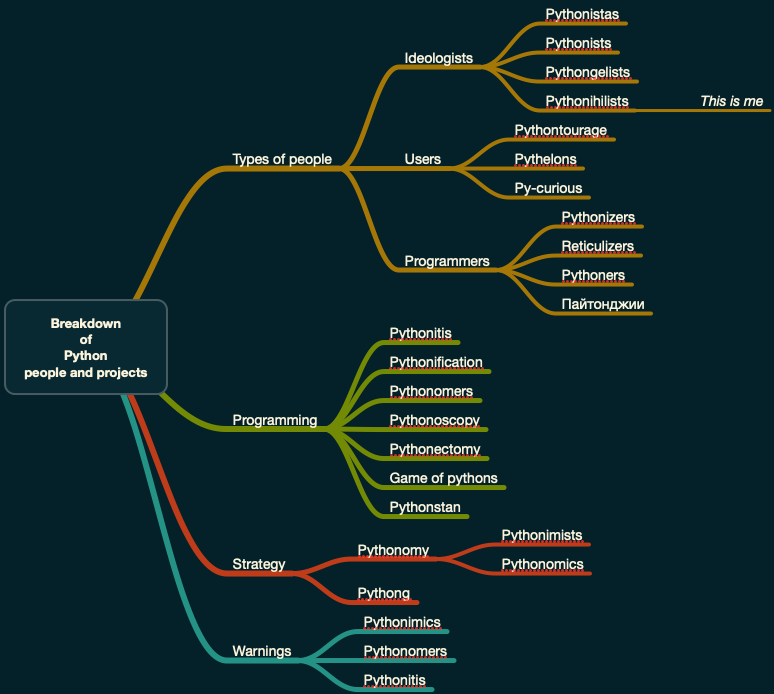

# Breakdown of Python people and projects

## Introduction

This document presents *an attempt* to breakdown the:

- People who use Python
- People who program (and think) in Python
- Projects with heavy use of Python

The attempt is mostly provocative, but maybe also insightful. 

------

## Breakdown mind-map

Here is a mind map of the proposed (attempted) breakdown:

(The mind map was made with the old, ~~better~~ version of [MindNode](https://www.mindnode.com).)

------

## Breakdown definitions

In this section we give definitions (or clarifications) of the nodes of mind-map above.

### Types of people

#### Ideologists

- **Pythonistas:** Really believe in Python as a way of life.

- **Pythonists:** Really believe Python is a programming language of great utility.  

- **Pythongelists:** Enthusiastically and eagerly propagate the ideas of Pythonistas and Pythonists. 

- **Pythonihilists:** Do not believe in Python that much at all; think that believing in Python is both detrimental and exploitable.

    - *In case it is not clear: this is me*.

#### Users

- **Pythontourage:** Managers, quality assurance engineers, or advocates found in and around Python projects. 

- **Pythelons:** Felons using Python. (For, say, phishing, crypto-extortion, hijacking, etc.)

- **Py-curious:** Programmers or users of other programming languages that are curious about Python. 

#### Programmers

- **Pythonizers:** See every problem through the Python-lens and produce engineering solutions based on Python.

- **Reticulizers:** Accommodate Python use or implementations in existing or future projects of different kind.

- **Pythoners:** Long-run Python users; maintain long-run projects based on Python.

- **Пайтонджии:** Труженици ползващи усилено Пайтон. На конвейeр. (Понякога принудително.)

### Programming

- **Pythonitis:** Unconscious transferring of Python idioms or macro or micro patterns into projects with other languages.  

- **Pythonification:** Attempts to have a unified user experience or user interface 

- **Pythonomers:** Standard computer science terms or algorithms misnamed in Python. 

- **Pythonoscopy:** Using Python to debug, monitor, or introspect a certain engineering solution.

- **Pythonectomy:** Removing Python from projects. Happens often in sufficiently advanced projects; 
  most frequently replaced with Java. 

- **Game of pythons:** Attempting to install or update Python on particular machine usually shows 
  that there are too many Pythons, often, with competing agendas. 

### Strategy

- **Pythonomy:** Python-driven software architecture.  

- **Pythonomics:** School of thought that believes that using Python produces cheap and convenient solutions. 

- **Pythonimists:** People justifying Python on economical or accounting grounds. 

- **Pythong:** Using Python in project management decisions.
   - "Nobody got fired for proposing Python in a project." 

### Warnings

- **Pythonimics:** Python (macro- or micro-) thinking mimicry. Especially applied to projects Python is not suitable for. 

- **Pythonomers:** See the definition above. For some reason, Python using different names for mainstream concepts
  in computer science. Maybe, because it was though that that would make Python more "user friendly."

- **Pythonidis:** See the definition above. It happens when on idiomatic level often enough.

------

## Contexts for informed hate

In this section we give some context for some of the definitions above.

### Python is a reaction to Perl

Python's inventor Guido van Rossum got scared from Perl, and decided to make a programming language 
based on the principle "There should be one-- and preferably only one --obvious way to do it" (TSBEO-APOO-OWTDI), 
[TP1].

In other words, using a principle that is an opposite of 
["There's more than one way to do it" (TIMTOWTDI)](https://en.wikipedia.org/wiki/There's_more_than_one_way_to_do_it).

Applying TSBEO-APOO-OWTDI is a very Dutch or Scandinavian way of doing things. 
For example, in those countries the following Japanese proverb broadly applies in every-day life:

> [A nail that sticks out gets hammered down.](https://en.wiktionary.org/wiki/the_nail_that_sticks_out_gets_hammered_down)

### Terminology by the underdeveloped

Much of the terminology of Python comes from the partially developed skills and computer science knowledge of 
its inventor and developers. Also, must Python users are "not brought to term" programmers, hence stupid or
inadequate terminology gets "free passes" from them.

Also, see [GvR1] in which Guido van Rossum discussed his not understanding of functional programming.  

### Capitalistic SAFe

Scaled Agile Framework (SAFe) -- also known as Shitty Agile For Enterprises, [GOTO14], [SM1] -- 
tries to combine the Waterfall and Agile methodologies. SAFe, of course, is often combined with managers short attention span and desires for 
cheap solutions (and workforce.) 

One consequence is that often Python is seen as the uniform skill and paradigm 
that is going to bring everything together cheaply. 

Another consequence is that all data scientists and machine learning engineers in those projects are seen 
to be fungible (because they all use Python.)

------

## References

[GOTO14] Goto;,
["A Retake on the Agile Manifesto • Humble, Thomas, Badiceanu, Fowler & Kirk • GOTO 2014"](https://www.youtube.com/watch?v=zNvmjPzdqKc),
(2014),
["Goto Conferences" channel at YouTube](https://www.youtube.com/c/GotoConferences).

[GvR1] ["The fate of reduce() in Python 3000"](https://www.artima.com/weblogs/viewpost.jsp?thread=98196).

[SM1] SmHarter,
["SAFE: A COLLECTION OF COMMENTS FROM LEADING EXPERTS – PART 2"](https://www.smharter.com/blog/safe-a-collection-of-comments-from-leading-experts-2/),
[smharter.com](https://www.smharter.com).

[TP1] Tim Peters, (19 August 2004).
["PEP 20 – The Zen of Python"](https://peps.python.org/pep-0020/).
[Python Enhancement Proposals](https://peps.python.org). Python Software Foundation.

[Wk1] Wikipedia entry
["Python (programming language)"](https://en.wikipedia.org/wiki/Python_(programming_language)).

[Wk3] Wikipedia entry
["There's more than one way to do it"](https://en.wikipedia.org/wiki/There's_more_than_one_way_to_do_it").

[Wk4] Wikipedia entry
["Scaled agile framework"](https://en.wikipedia.org/wiki/Scaled_agile_framework).
