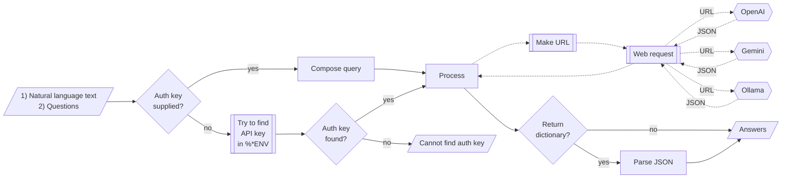

# LLMTextualAnswer Python package

## Introduction

This notebook demonstrates the usage of the Python package ["LLMTextualAnswer"](https://pypi.org/project/LLMTextualAnswer/), [AAp1], which provides function(s) for finding sub-strings in texts that appear to be answers to given questions according to Large Language Models (LLMs). The package implementation closely follows the implementations of the Raku package ["ML::FindTextualAnswer"](https://raku.land/zef:antononcube/ML::FindTextualAnswer), [AAp1], and Wolfram Language function [`LLMTextualAnswer`](https://resources.wolframcloud.com/FunctionRepository/resources/LLMTextualAnswer/), [AAf1]. Both, in turn, were inspired by the Wolfram Language function [`FindTextualAnswer`](https://reference.wolfram.com/language/ref/FindTextualAnswer.html), [WRIf1, JL1].

**Remark:** Currently, LLMs are utilized via the Python ["LangChain"](https://www.langchain.com) packages.

**Remark:** One of the primary motivations for implementing this package is to provide the fundamental functionality of extracting parameter values from (domain specific) texts needed for the implementation for the Python version of the Raku package ["ML::NLPTemplateEngine"](https://raku.land/zef:antononcube/ML::NLPTemplateEngine), [AAp3].

---

## Installation

To install the package from [PyPI.org](https://pypi.org/) use the shell command:

```shell
python3 -m install LLMFindTextualAnswer
```

To install the package from the GitHub repository use the shell command:

```shell
python3 -m pip install git+https://github.com/antononcube/Python-LLMTextualAnswer.git#egg=LLMTextualAnswer
```

-----

## Setup

Load packages and define LLM access objects:

```python
from LLMTextualAnswer import *
from langchain_ollama import ChatOllama
import os

llm = ChatOllama(model=os.getenv("OLLAMA_MODEL", "gemma3:4b"))
```

---

## Usage examples

Here is an example of finding textual answers:

```python
text = """
Lake Titicaca is a large, deep lake in the Andes 
on the border of Bolivia and Peru. By volume of water and by surface 
area, it is the largest lake in South America
"""

llm_textual_answer(text, "Where is Titicaca?", llm=llm, form = None)
```

```
# {'Where is Titicaca?': 'The Andes, on the border of Bolivia Peru'}
```

By default `llm_textual_answer` tries to give short answers. If the option "request" is `None` then depending on the number of questions the request is one those phrases:

- "give the shortest answer of the question:"
- "list the shortest answers of the questions:"


In the example above the full query given to LLM is:

> Given the text "Lake Titicaca is a large, deep lake in the Andes on the border of Bolivia and Peru. By volume of water and by surface area, it is the largest lake in South America" give the shortest answer of the question:   
> Where is Titicaca?


Here we get a longer answer by changing the value of "request":

```python
llm_textual_answer(text, "Where is Titicaca?", request = "answer the question:", llm = llm)
```

```
# {'Where is Titicaca?': 'The Andes, on the border of Bolivia Peru'}
```

**Remark:** The function `find-textual-answer` is inspired by the Mathematica function [`FindTextualAnswer`](https://reference.wolfram.com/language/ref/FindTextualAnswer.html), [WRIf1]; see [JL1] for details. Unfortunately, at this time implementing the full signature of `FindTextualAnswer` with LLM-provider APIs is not easy.

### Multiple answers

Consider the text: 

```python
textCap = """
Born and raised in the Austrian Empire, Tesla studied engineering and physics in the 1870s without receiving a degree,
gaining practical experience in the early 1880s working in telephony and at Continental Edison in the new electric power industry.

In 1884 he emigrated to the United States, where he became a naturalized citizen.
He worked for a short time at the Edison Machine Works in New York City before he struck out on his own.
With the help of partners to finance and market his ideas,
Tesla set up laboratories and companies in New York to develop a range of electrical and mechanical devices.
His alternating current (AC) induction motor and related polyphase AC patents, licensed by Westinghouse Electric in 1888,
earned him a considerable amount of money and became the cornerstone of the polyphase system which that company eventually marketed.
"""

len(textCap)
```

```
# 862
```

Here we ask a single question and request 3 answers:

```python
llm_textual_answer(textCap, 'Where lived?', n = 3, llm = llm)
```

```
# {'Where lived?': 'Austrian Empire, United States, New York City'}
```

Here is a rerun without number of answers argument:

```python
llm_textual_answer(textCap, 'Where lived?', llm = llm)
```

```
# {'Where lived?': 'Austrian Empire, United States'}
```

### Multiple questions

If several questions are given to the function `llm_textual_answer` then all questions are spliced with the given text into one query (that is sent to LLM.)

For example, consider the following text and questions:

```python
query = 'Make a classifier with the method RandomForest over the data dfTitanic; show precision and accuracy.';

questions = [
        'What is the dataset?',
        'What is the method?',
        'Which metrics to show?'
]
```

Then the query send to the LLM is:

> Given the text: "Make a classifier with the method RandomForest over the data dfTitanic; show precision and accuracy."
> list the shortest answers of the questions:   
> 1) What is the dataset?   
> 2) What is the method?    
> 3) Which metrics to show?   


The answers are assumed to be given in the same order as the questions, each answer in a separated line. Hence, by splitting the LLM result into lines we get the answers corresponding to the questions.  

**Remark:** For some LLMs, if the questions are missing question marks, it is likely that the result may have a completion as a first line followed by the answers. In that situation the answers are not parsed and a warning message is given.

Here is an example of requesting answers of multiple questions and specifying that the result should be a dictionary: 

```python
res = llm_textual_answer(query, questions, llm = llm, form = dict)

for (k,v) in res.items():
    print(f"{k} : {v}")
```

```
# What is the dataset? : dfTitanic
# What is the method? : RandomForest
# Which metrics to show? : Precision, accuracy

```

---

## Mermaid diagram

The following flowchart corresponds to the ***conceptual*** steps in the package function `llm_textual_answer`:



---

## References

### Articles

[JL1] Jérôme Louradour, ["New in the Wolfram Language: FindTextualAnswer"](https://blog.wolfram.com/2018/02/15/new-in-the-wolfram-language-findtextualanswer), (2018), [blog.wolfram.com](https://blog.wolfram.com/).

### Functions

[AAf1] Anton Antonov, [LLMTextualAnswer](https://resources.wolframcloud.com/FunctionRepository/resources/LLMTextualAnswer/), (2024), [Wolfram Function Repository](https://resources.wolframcloud.com/FunctionRepository).

[WRIf1] Wolfram Research, Inc., [FindTextualAnswer](https://reference.wolfram.com/language/ref/FindTextualAnswer.html), [Wolfram Language function](https://reference.wolfram.com/language/), (2018), (updated 2020).

### Packages

[AAp1] Anton Antonov, [LLMTextualAnswer, Python package](https://github.com/antononcube/Python-LLMTextualAnswer), (2026), [GitHub/antononcube](https://github.com/antononcube).

[AAp2] Anton Antonov, [ML::FindTextualAnswer, Raku package](https://github.com/antononcube/Raku-ML-FindTextualAnswer), (2023-2025), [GitHub/antononcube](https://github.com/antononcube).

[AAp3] Anton Antonov, [ML::NLPTemplateEngine, Raku package](https://github.com/antononcube/Raku-ML-NLPTemplateEngine), (2023-2025), [GitHub/antononcube](https://github.com/antononcube).