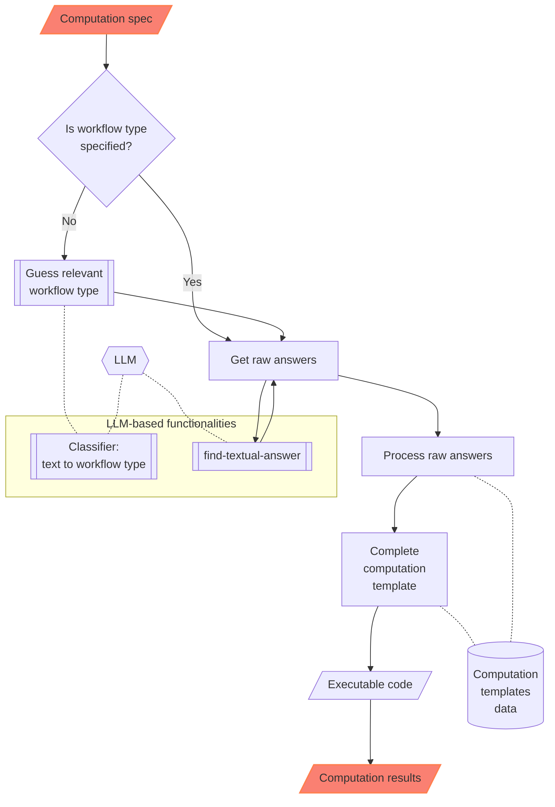

# NLPTemplateEngine (vignette)

The Python package ["NLPTemplateEngine"](https://pypi.org/project/NLPTemplateEngine/), [AAp1], aims to create (nearly) executable code for various computational workflows.

Package's data and implementation make a Natural Language Processing (NLP) [Template Engine (TE)](https://en.wikipedia.org/wiki/Template_processor), [Wk1],  that incorporates [Question Answering Systems (QAS')](https://en.wikipedia.org/wiki/Question_answering), [Wk2], and Machine Learning (ML) classifiers.

The current version of the NLP-TE of the package heavily relies on Large Language Models (LLMs) for its QAS component.

Future plans involve incorporating other types of QAS implementations.

This Python package implementation closely follows the Raku implementation in ["ML::TemplateEngine"](https://raku.land/zef:antononcube/ML::NLPTemplateEngine), [AAp4], which, in turn, closely follows the Wolfram Language (WL) implementations in ["NLP Template Engine"](https://github.com/antononcube/NLP-Template-Engine), [AAr1, AAv1],
and the WL paclet ["NLPTemplateEngine"](https://resources.wolframcloud.com/PacletRepository/resources/AntonAntonov/NLPTemplateEngine/), [AAp5, AAv2].

An alternative, more comprehensive approach to building workflows code is given in [AAp2]. Another alternative is to use few-shot training of LLMs with examples provided by, say,  the Python package ["DSLExamples"](https://pypi.org/project/DSLExamples), [AAp6].

**Remark:** See the [vignette notebook](https://github.com/antononcube/Python-NLPTemplateEngine/blob/main/docs/NLPTemplateEngine-vignette.ipynb) corresponding to this document. 

### Problem formulation

We want to have a system (i.e. TE) that:

1. Generates relevant, correct, executable programming code based on natural language specifications of computational
   workflows

2. Can automatically recognize the workflow types

3. Can generate code for different programming languages and related software packages

The points above are given in order of importance; the most important are placed first.

### Reliability of results

One of the main reasons to re-implement the WL NLP-TE, [AAr1, AAp1], into Raku is to have a more robust way of utilizing LLMs to generate code. That goal is more or less achieved with this package, but YMMV -- if incomplete or wrong results are obtained run the NLP-TE with different LLM parameter settings or different LLMs.

------

## Installation

From Zef ecosystem:

```
python3 -m pip install NLPTemplateEngine
```

----

## Setup

Load packages and define LLM access objects:

```python
from NLPTemplateEngine import *
from langchain_ollama import ChatOllama
import os


llm = ChatOllama(model=os.getenv("OLLAMA_MODEL", "gemma3:12b"))
```

-----

## Usage examples

### Quantile Regression (WL)

Here the template is automatically determined:

```python
from NLPTemplateEngine import *

qrCommand = """
Compute quantile regression with probabilities 0.4 and 0.6, with interpolation order 2, for the dataset dfTempBoston.
"""

concretize(qrCommand, llm=llm)
```

```
# qrObj=
# QRMonUnit[dfTempBoston]⟹
# QRMonEchoDataSummary[]⟹
# QRMonQuantileRegression[12, {0.4,0.6}, InterpolationOrder->2]⟹
# QRMonPlot["DateListPlot"->False,PlotTheme->"Detailed"]⟹
# QRMonErrorPlots["RelativeErrors"->False,"DateListPlot"->False,PlotTheme->"Detailed"];
```

**Remark:** In the code above the template type, "QuantileRegression", was determined using an LLM-based classifier.

### Latent Semantic Analysis (R)

```python
lsaCommand = """
Extract 20 topics from the text corpus aAbstracts using the method NNMF. 
Show statistical thesaurus with the words neural, function, and notebook.
"""

concretize(lsaCommand, template = 'LatentSemanticAnalysis', lang = 'R')
```

```
# lsaObj <-
# LSAMonUnit(aAbstracts) %>%
# LSAMonMakeDocumentTermMatrix(stemWordsQ = Automatic, stopWords = Automatic) %>%
# LSAMonEchoDocumentTermMatrixStatistics(logBase = 10) %>%
# LSAMonApplyTermWeightFunctions(globalWeightFunction = "IDF", localWeightFunction = "None", normalizerFunction = "Cosine") %>%
# LSAMonExtractTopics(numberOfTopics = 20, method = "NNMF", maxSteps = 16, minNumberOfDocumentsPerTerm = 20) %>%
# LSAMonEchoTopicsTable(numberOfTerms = 10, wideFormQ = TRUE) %>%
# LSAMonEchoStatisticalThesaurus(words = c("neural", "function", "notebook"))
```

### Random tabular data generation (Raku)

```python
command = """
Make random table with 6 rows and 4 columns with the names <A1 B2 C3 D4>.
"""

concretize(command, template = 'RandomTabularDataset', lang = 'Raku', llm=llm)
```

```
# random-tabular-dataset(6, 4, "column-names-generator" => <A1 B2 C3 D4>, "form" => "table", "max-number-of-values" => 24, "min-number-of-values" => 24, "row-names" => False)
```

**Remark:** In the code above it was specified to use Google's Gemini LLM service.

### Recommender workflow (Python)

```python
command = """
Make a commander over the data set @dsTitanic and compute 8 recommendations for the profile (passengerSex:male, passengerClass:2nd).
"""

concretize(command, lang = 'Python', llm=llm)
```

```
# smrObj = (SparseMatrixRecommender()
# .create_from_wide_form(data = dsTitanic, item_column_name='id', columns=None, add_tag_types_to_column_names=True, tag_value_separator=':')
# .apply_term_weight_functions(global_weight_func = 'IDF', local_weight_func = 'None', normalizer_func = 'Cosine')
# .recommend_by_profile(profile=(passengerSex:male, passengerClass:2nd), nrecs=8)
# .join_across(data=dsTitanic, on='id')
# .echo_value())
```

------

## How it works?

The following flowchart describes how the NLP Template Engine involves a series of steps for processing a computation specification and executing code to obtain results:



Here's a detailed narration of the process:

1. **Computation Specification**:
    - The process begins with a "Computation spec", which is the initial input defining the requirements or parameters
      for the computation task.

2. **Workflow Type Decision**:
    - A decision node asks if the workflow type is specified.

3. **Guess Workflow Type**:
    - If the workflow type is not specified, the system utilizes a classifier to guess relevant workflow type.

4. **Raw Answers**:
    - Regardless of how the workflow type is determined (directly specified or guessed), the system retrieves "raw
      answers", crucial for further processing.

5. **Processing and Templating**:
    - The raw answers undergo processing ("Process raw answers") to organize or refine the data into a usable format.
    - Processed data is then utilized to "Complete computation template", preparing for executable operations.

6. **Executable Code and Results**:
    - The computation template is transformed into "Executable code", which when run, produces the final "Computation
      results".

7. **LLM-Based Functionalities**:
    - The classifier and the answers finder are LLM-based.

8. **Data and Templates**:
    - Code templates are selected based on the specifics of the initial spec and the processed data.

------

## Bring your own templates

**0.** Load the NLP-Template-Engine package (and others):

```python
from NLPTemplateEngine import *
import pandas as pd
```

**1.** Get the "training" templates data (from CSV file you have created or changed) for a new workflow (["SendMail"](https://github.com/antononcube/NLP-Template-Engine/blob/main/TemplateData/dsQASParameters-SendMail.csv)):

```python
url = 'https://raw.githubusercontent.com/antononcube/NLP-Template-Engine/main/TemplateData/dsQASParameters-SendMail.csv'
dsSendMail = pd.read_csv(url)

dsSendMail.describe()
```


**2.** Add the ingested data for the new workflow (from the CSV file) into the NLP-Template-Engine:

```python
add_template_data(dsSendMail, llm=llm)
```

```
# (ParameterTypePatterns Defaults ParameterQuestions Questions Shortcuts Templates)
```

**3.** Parse natural language specification with the newly ingested and onboarded workflow ("SendMail"):

```python
cmd = "Send email to joedoe@gmail.com with content RandomReal[343], and the subject this is a random real call."
concretize(cmd, template = "SendMail", lang = 'WL', llm=llm) 
```

```
# SendMail[<|"To"->{"joedoe@gmail.com"},"Subject"->"this is a random real call","Body"->RandomReal[343],"AttachedFiles"->None|>]
```

**4.** Experiment with running the generated code!

------

## References

### Articles, blog posts

[AA1] Anton Antonov, ["DSL examples with LangChain"](https://pythonforprediction.wordpress.com/2026/02/12/dsl-examples-with-langchain/), (2026), [PythonForPrediction at WordPress](https://pythonforprediction.wordpress.com).

[Wk1] Wikipedia entry, [Template processor](https://en.wikipedia.org/wiki/Template_processor).

[Wk2] Wikipedia entry, [Question answering](https://en.wikipedia.org/wiki/Question_answering).

### Functions, packages, repositories

[AAr1] Anton Antonov, ["NLP Template Engine"](https://github.com/antononcube/NLP-Template-Engine), (2021-2022), [GitHub/antononcube](https://github.com/antononcube).

[AAp1] Anton Antonov, [NLPTemplateEngine, Python package](https://github.com/antononcube/Python-NLPTemplateEngine), (2026), [GitHub/antononcube](https://github.com/antononcube/Python-NLPTemplateEngine).

[AAp2] Anton Antonov, [DSL::Translators, Raku package](https://github.com/antononcube/Raku-DSL-Translators), (2020-2025), [GitHub/antononcube](https://github.com/antononcube).

[AAp3] Anton Antonov, [DSL::Examples, Raku package](https://github.com/antononcube/Raku-DSL-Examples), (2024-2025), [GitHub/antononcube](https://github.com/antononcube).

[AAp4] Anton Antonov, [ML::TemplateEngine, Raku package](https://github.com/antononcube/Raku-ML-TemplateEngine), (2023-2025), [GitHub/antononcube](https://github.com/antononcube).

[AAp5] Anton Antonov, [NLPTemplateEngine, WL paclet](https://resources.wolframcloud.com/PacletRepository/resources/AntonAntonov/NLPTemplateEngine/), (2023), [Wolfram Language Paclet Repository](https://resources.wolframcloud.com/PacletRepository/).

[AAp6] Anton Antonov, [DSLExamples, Python package](https://github.com/antononcube/Python-DSLExamples), (2026), [GitHub/antononcube](https://github.com/antononcube).

[WRI1] Wolfram Research, [FindTextualAnswer]( https://reference.wolfram.com/language/ref/FindTextualAnswer.html), (2018), [Wolfram Language function](https://reference.wolfram.com), (updated 2020).

### Videos

[AAv1] Anton Antonov, ["NLP Template Engine, Part 1"](https://youtu.be/a6PvmZnvF9I), (2021), [YouTube/@AAA4Prediction](https://www.youtube.com/@AAA4Prediction).

[AAv2] Anton Antonov, ["Natural Language Processing Template Engine"](https://www.youtube.com/watch?v=IrIW9dB5sRM) presentation given at  WTC-2022, (2023), [YouTube/@Wolfram](https://www.youtube.com/@Wolfram).
